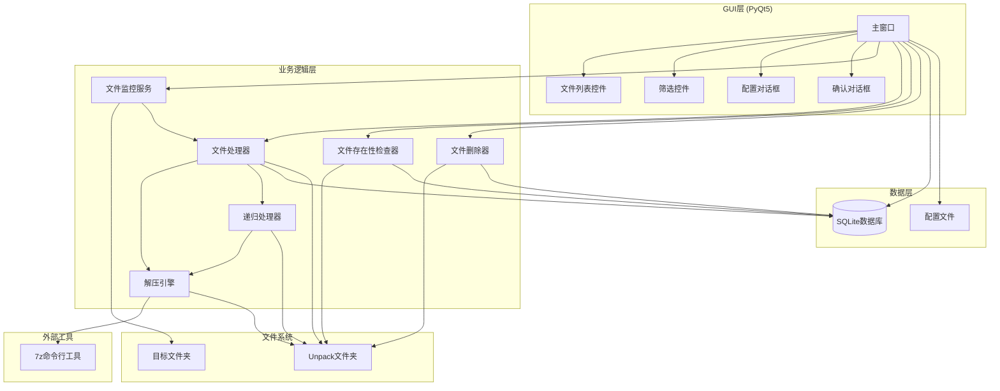
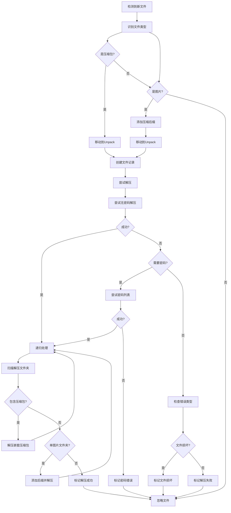
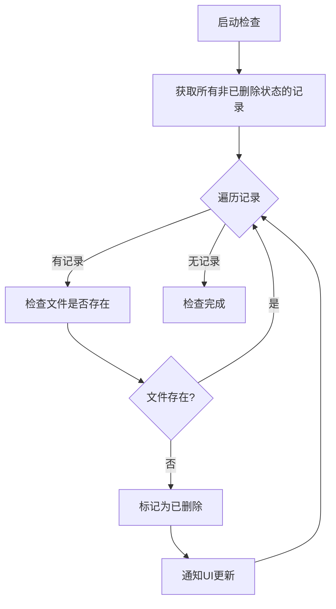
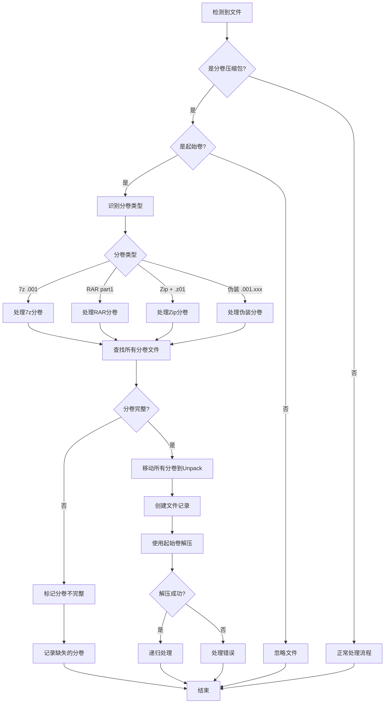

# 设计文档

## 概述

自动解压管理器是一个基于文件系统监控的桌面应用程序。使用Python和PyQt5构建，提供图形用户界面。系统通过文件系统监控器实时检测新文件，使用7z命令行工具进行解压操作，支持密码尝试和递归解压，并通过SQLite数据库持久化文件处理记录。系统可打包为独立的Windows可执行文件，使用配置文件持久化设置，支持文件删除检测和管理功能。

## 架构

### 系统架构图



### 架构层次

1. **GUI层**: 基于PyQt5的桌面应用界面，提供文件列表展示、状态筛选和配置管理
2. **业务逻辑层**: 文件监控、处理、解压和管理的核心逻辑
3. **数据层**: SQLite数据库存储文件记录，JSON配置文件存储系统设置
4. **外部工具层**: 7z命令行工具执行实际解压操作

## 组件和接口

### 1. 文件监控服务 (FileMonitor)

**职责**: 监控目标文件夹，检测新文件并触发处理流程

**接口**:
```python
class FileMonitor:
    def __init__(self, target_folder: str, callback: Callable):
        """初始化文件监控器"""
        
    def start(self) -> None:
        """启动监控"""
        
    def stop(self) -> None:
        """停止监控"""
        
    def _on_created(self, event) -> None:
        """文件创建事件处理器"""
```

**实现细节**:
- 使用`watchdog`库监控文件系统事件
- 仅响应文件创建事件，忽略目录和修改事件
- 通过回调函数将新文件传递给处理器

### 2. 文件类型识别器 (FileTypeDetector)

**职责**: 识别文件类型（压缩包、图片、分卷压缩包）

**接口**:
```python
class FileTypeDetector:
    ARCHIVE_EXTENSIONS = {'.zip', '.rar', '.7z', '.tar', '.gz', '.bz2'}
    IMAGE_EXTENSIONS = {'.jpg', '.jpeg', '.png', '.gif', '.bmp', '.webp'}
    
    @staticmethod
    def is_archive(file_path: str) -> bool:
        """判断是否为压缩包"""
        
    @staticmethod
    def is_image(file_path: str) -> bool:
        """判断是否为图片"""
        
    @staticmethod
    def get_file_type(file_path: str) -> str:
        """获取文件类型: 'archive', 'image', 'multi_volume', 'volume_part', 'unknown'"""
        
    @staticmethod
    def is_leader_volume(file_path: str) -> bool:
        """判断是否为分卷压缩包的起始卷"""
        
    @staticmethod
    def is_volume_part(file_path: str) -> bool:
        """判断是否为分卷压缩包的非起始卷"""
        
    @staticmethod
    def detect_volume_type(file_path: str) -> str:
        """检测分卷类型: '7z', 'rar', 'zip', 'disguised', 'none'"""
```

**分卷识别规则**:
- **7z分卷**: 匹配 `.001` 后缀（如 `game.7z.001`）
- **RAR分卷**: 匹配 `part1.rar` 或 `part01.rar` 或 `.part1.rar`
- **Zip分卷**: 匹配 `.zip` 且同目录存在 `.z01` 文件
- **伪装分卷**: 匹配包含 `.001.` 的路径（如 `game.7z.001.pdf`）

### 3. 文件处理器 (FileProcessor)

**职责**: 协调文件移动、解压和状态更新

**接口**:
```python
class FileProcessor:
    def __init__(self, unpack_folder: str, extractor: Extractor, 
                 db: Database, config: Config):
        """初始化文件处理器"""
        
    def process_file(self, file_path: str) -> None:
        """处理单个文件"""
        
    def _move_file(self, source: str, destination: str) -> str:
        """移动文件到Unpack文件夹"""
        
    def _handle_archive(self, file_path: str, record_id: int) -> None:
        """处理压缩包文件"""
        
    def _handle_image(self, file_path: str, record_id: int) -> None:
        """处理图片文件（添加后缀）"""
        
    def _handle_multi_volume(self, file_path: str, record_id: int) -> None:
        """处理分卷压缩包"""
        
    def _should_skip_file(self, file_path: str) -> bool:
        """判断是否应跳过文件（如非起始分卷）"""
```

**实现细节**:
- 检测到分卷压缩包时，仅处理起始卷
- 非起始卷（.002, .003等）被自动忽略
- 分卷文件一起移动到Unpack文件夹

### 4. 解压引擎 (Extractor)

**职责**: 使用打包的7z工具执行解压操作，支持密码尝试和分卷压缩包

**接口**:
```python
class Extractor:
    def __init__(self, seven_zip_path: str = None):
        """初始化解压引擎，如果未指定路径则使用打包的7z"""
        
    def get_bundled_7z_path(self) -> str:
        """获取打包的7z.exe路径"""
        
    def check_7z_available(self) -> bool:
        """检查7z是否可用"""
        
    def extract(self, archive_path: str, output_dir: str, 
                passwords: List[str] = None) -> ExtractionResult:
        """解压文件，支持密码尝试和分卷压缩包"""
        
    def _try_extract_with_password(self, archive_path: str, 
                                   output_dir: str, password: str = None) -> Tuple[bool, str]:
        """尝试使用指定密码解压"""
        
    def _parse_error(self, stderr: str) -> str:
        """解析7z错误信息，判断错误类型"""
        
    def verify_volume_completeness(self, leader_path: str) -> Tuple[bool, List[str]]:
        """验证分卷文件完整性，返回(是否完整, 缺失的分卷列表)"""
```

**实现细节**:
- 7z.exe和7z.dll将被打包到应用程序的resources目录
- 使用PyInstaller的--add-data参数将7z文件包含到exe中
- 运行时从临时目录或应用程序目录加载7z
- 对于分卷压缩包，7z会自动关联同目录下的其他分卷文件
- 仅需传递起始卷路径给7z命令

**ExtractionResult数据类**:
```python
@dataclass
class ExtractionResult:
    success: bool
    error_type: str  # 'none', 'password', 'corrupted', 'other'
    error_message: str
    used_password: str = None
```

### 5. 递归处理器 (RecursiveHandler)

**职责**: 处理解压后的嵌套压缩包和单图片文件夹

**接口**:
```python
class RecursiveHandler:
    def __init__(self, extractor: Extractor, config: Config):
        """初始化递归处理器"""
        
    def process_extracted_folder(self, folder_path: str, 
                                 passwords: List[str]) -> None:
        """递归处理解压后的文件夹"""
        
    def _find_archives(self, folder_path: str) -> List[str]:
        """查找文件夹中的所有压缩包"""
        
    def _is_single_image_folder(self, folder_path: str) -> Tuple[bool, str]:
        """检查是否为只包含单个图片的文件夹"""
        
    def _handle_single_image(self, image_path: str, 
                            passwords: List[str]) -> None:
        """处理单图片文件（添加后缀并解压）"""
```

### 6. 数据库管理器 (Database)

**职责**: 管理文件处理记录的持久化存储

**接口**:
```python
class Database:
    def __init__(self, db_path: str):
        """初始化数据库连接"""
        
    def create_record(self, filename: str, original_path: str) -> int:
        """创建新的文件记录"""
        
    def update_status(self, record_id: int, status: str, 
                     error_message: str = None) -> None:
        """更新文件处理状态"""
        
    def get_all_records(self) -> List[FileRecord]:
        """获取所有文件记录"""
        
    def get_records_by_status(self, status: str) -> List[FileRecord]:
        """按状态筛选文件记录"""
        
    def delete_record(self, record_id: int) -> None:
        """删除文件记录"""
        
    def get_file_path(self, record_id: int) -> str:
        """获取文件在Unpack文件夹中的路径"""
```

**FileRecord数据类**:
```python
@dataclass
class FileRecord:
    id: int
    filename: str
    original_path: str
    moved_time: datetime
    status: str  # 'moved', 'extracting', 'success', 'failed', 
                 # 'password_error', 'corrupted', 'recursive_processing', 'deleted'
    error_message: str = None
    updated_time: datetime = None
```

### 7. 配置管理器 (ConfigManager)

**职责**: 管理系统配置参数

**接口**:
```python
class ConfigManager:
    def __init__(self, config_path: str = 'config.json'):
        """初始化配置管理器"""
        
    def load(self) -> Config:
        """加载配置"""
        
    def save(self, config: Config) -> None:
        """保存配置"""
        
    def validate(self, config: Config) -> Tuple[bool, str]:
        """验证配置有效性"""
```

**Config数据类**:
```python
@dataclass
class Config:
    target_folder: str
    unpack_folder: str
    passwords: List[str]
    image_archive_suffix: str = '.zip'
    seven_zip_path: str = '7z'
```

### 8. 文件存在性检查器 (FileChecker)

**职责**: 定期检查已记录文件是否仍然存在，标记已删除的文件

**接口**:
```python
class FileChecker:
    def __init__(self, db: Database, unpack_folder: str):
        """初始化文件检查器"""
        
    def check_all_files(self) -> List[int]:
        """检查所有已记录文件的存在性，返回已删除文件的ID列表"""
        
    def check_file(self, record_id: int) -> bool:
        """检查单个文件是否存在"""
        
    def mark_as_deleted(self, record_id: int) -> None:
        """标记文件为已删除状态"""
```

**实现细节**:
- 启动时检查所有已记录文件
- 定期（每5分钟）检查文件存在性
- 使用线程避免阻塞GUI

### 9. 文件删除器 (FileDeleter)

**职责**: 处理用户的文件删除和记录删除请求

**接口**:
```python
class FileDeleter:
    def __init__(self, db: Database, unpack_folder: str):
        """初始化文件删除器"""
        
    def delete_file(self, record_id: int) -> Tuple[bool, str]:
        """删除文件（压缩包和解压文件夹），返回成功状态和消息"""
        
    def delete_record(self, record_id: int, also_delete_file: bool = False) -> Tuple[bool, str]:
        """删除记录，可选同时删除文件"""
        
    def _delete_archive_and_folder(self, filename: str) -> bool:
        """删除压缩包文件和对应的解压文件夹"""
```

### 10. 主窗口 (MainWindow)

**职责**: PyQt5主窗口，协调所有GUI组件和业务逻辑

**接口**:
```python
class MainWindow(QMainWindow):
    def __init__(self):
        """初始化主窗口"""
        
    def init_ui(self) -> None:
        """初始化UI组件"""
        
    def load_records(self) -> None:
        """加载文件记录到列表"""
        
    def refresh_records(self) -> None:
        """刷新文件记录显示"""
        
    def on_filter_changed(self, status: str) -> None:
        """处理筛选条件变化"""
        
    def on_delete_file_clicked(self, record_id: int) -> None:
        """处理删除文件按钮点击"""
        
    def on_delete_record_clicked(self, record_id: int) -> None:
        """处理删除记录按钮点击"""
        
    def on_config_clicked(self) -> None:
        """打开配置对话框"""
        
    def start_monitoring(self) -> None:
        """启动文件监控"""
        
    def stop_monitoring(self) -> None:
        """停止文件监控"""
```

### 11. 文件列表控件 (FileListWidget)

**职责**: 显示文件记录列表，支持排序和操作按钮

**接口**:
```python
class FileListWidget(QTableWidget):
    def __init__(self, parent=None):
        """初始化文件列表控件"""
        
    def set_records(self, records: List[FileRecord]) -> None:
        """设置要显示的文件记录"""
        
    def add_record(self, record: FileRecord) -> None:
        """添加单条记录"""
        
    def update_record(self, record: FileRecord) -> None:
        """更新记录显示"""
        
    def _create_action_buttons(self, record_id: int) -> QWidget:
        """创建操作按钮（删除文件、删除记录）"""
```

**显示列**:
- 文件名
- 原始路径
- 移动时间
- 状态（带颜色标识）
- 操作按钮

### 12. 筛选控件 (FilterWidget)

**职责**: 提供状态筛选功能

**接口**:
```python
class FilterWidget(QWidget):
    filter_changed = pyqtSignal(str)  # 筛选条件变化信号
    
    def __init__(self, parent=None):
        """初始化筛选控件"""
        
    def set_status_counts(self, counts: Dict[str, int]) -> None:
        """设置各状态的文件数量"""
        
    def get_selected_status(self) -> str:
        """获取当前选中的状态"""
```

**筛选选项**:
- 全部
- 已移动
- 解压成功
- 解压失败
- 密码错误
- 文件损坏
- 已删除

### 13. 配置对话框 (ConfigDialog)

**职责**: 提供配置编辑界面

**接口**:
```python
class ConfigDialog(QDialog):
    def __init__(self, config: Config, parent=None):
        """初始化配置对话框"""
        
    def get_config(self) -> Config:
        """获取用户编辑后的配置"""
        
    def validate_config(self) -> Tuple[bool, str]:
        """验证配置有效性"""
```

**配置项**:
- 目标文件夹路径（带浏览按钮）
- Unpack文件夹路径（带浏览按钮）
- 密码列表（可添加、删除、排序）
- 图片压缩后缀
- 7z路径

### 14. 确认对话框 (ConfirmDialog)

**职责**: 显示删除确认对话框

**接口**:
```python
class ConfirmDialog(QDialog):
    @staticmethod
    def confirm_delete_file(filename: str, parent=None) -> bool:
        """确认删除文件"""
        
    @staticmethod
    def confirm_delete_record(filename: str, parent=None) -> Tuple[bool, bool]:
        """确认删除记录，返回(是否确认, 是否同时删除文件)"""
```

### 15. 打包配置 (PackagingConfig)

**职责**: 配置PyInstaller打包参数

**打包要求**:
- 使用PyInstaller打包为单个exe文件
- 包含所有Python依赖（PyQt5, watchdog, sqlite3等）
- 包含7z工具文件（7z.exe, 7z.dll）
- 包含应用图标
- 配置文件和数据库存储在exe同目录或%APPDATA%目录
- 首次运行时创建默认配置文件

**7z文件集成**:
- 从7-Zip官方下载独立的命令行版本（7z.exe和7z.dll）
- 将7z文件放在项目的resources目录
- 使用PyInstaller的--add-data参数打包

**PyInstaller配置**:
```python
# spec文件配置
import os

# 7z文件路径
seven_zip_files = [
    ('resources/7z.exe', 'resources'),
    ('resources/7z.dll', 'resources')
]

a = Analysis(
    ['main.py'],
    pathex=[],
    binaries=[],
    datas=[
        ('icon.ico', '.'),
        *seven_zip_files
    ],
    hiddenimports=['PyQt5'],
    hookspath=[],
    hooksconfig={},
    runtime_hooks=[],
    excludes=[],
    win_no_prefer_redirects=False,
    win_private_assemblies=False,
    cipher=None,
    noarchive=False,
)

pyz = PYZ(a.pure, a.zipped_data, cipher=None)

exe = EXE(
    pyz,
    a.scripts,
    a.binaries,
    a.zipfiles,
    a.datas,
    [],
    name='AutoUnpackManager',
    debug=False,
    bootloader_ignore_signals=False,
    strip=False,
    upx=True,
    upx_exclude=[],
    runtime_tmpdir=None,
    console=False,  # 不显示控制台窗口
    icon='icon.ico'
)
```

**运行时7z路径获取**:
```python
def get_7z_path():
    """获取打包的7z.exe路径"""
    if getattr(sys, 'frozen', False):
        # 打包后的exe环境
        base_path = sys._MEIPASS
    else:
        # 开发环境
        base_path = os.path.dirname(__file__)
    
    return os.path.join(base_path, 'resources', '7z.exe')
```

## 数据模型

### 数据库Schema

```sql
CREATE TABLE file_records (
    id INTEGER PRIMARY KEY AUTOINCREMENT,
    filename TEXT NOT NULL,
    original_path TEXT NOT NULL,
    moved_time TIMESTAMP DEFAULT CURRENT_TIMESTAMP,
    status TEXT NOT NULL,
    error_message TEXT,
    updated_time TIMESTAMP DEFAULT CURRENT_TIMESTAMP
);

CREATE INDEX idx_status ON file_records(status);
CREATE INDEX idx_moved_time ON file_records(moved_time DESC);
```

### 配置文件格式 (config.json)

```json
{
    "target_folder": "C:/Downloads",
    "unpack_folder": "C:/Unpack",
    "passwords": [
        "password123",
        "12345678",
        "admin"
    ],
    "image_archive_suffix": ".zip",
    "seven_zip_path": "7z"
}
```

## 处理流程

### 主处理流程



### 密码尝试流程

```mermaid
flowchart TD
    Start[开始解压] --> TryNoPass[尝试无密码]
    TryNoPass --> Check1{成功?}
    Check1 -->|是| Success[返回成功]
    Check1 -->|否| NeedPass{需要密码?}
    
    NeedPass -->|否| Error[返回错误]
    NeedPass -->|是| InitLoop[初始化密码索引 i=0]
    
    InitLoop --> HasMore{i < 密码数量?}
    HasMore -->|否| AllFailed[返回密码错误]
    HasMore -->|是| TryPass[尝试密码[i]]
    
    TryPass --> Check2{成功?}
    Check2 -->|是| RecordPass[记录成功密码]
    Check2 -->|否| NextPass[i++]
    
    RecordPass --> Success
    NextPass --> HasMore
```

### 文件删除流程

```mermaid
flowchart TD
    Start[用户点击删除按钮] --> IsFile{删除文件?}
    
    IsFile -->|是| ConfirmFile[显示删除文件确认对话框]
    IsFile -->|否| ConfirmRecord[显示删除记录确认对话框]
    
    ConfirmFile --> UserConfirmFile{用户确认?}
    UserConfirmFile -->|否| End[取消操作]
    UserConfirmFile -->|是| DeleteArchive[删除压缩包文件]
    
    DeleteArchive --> DeleteFolder[删除解压文件夹]
    DeleteFolder --> MarkDeleted[标记记录为已删除]
    MarkDeleted --> RefreshUI[刷新界面]
    RefreshUI --> End
    
    ConfirmRecord --> ShowOption[显示"同时删除文件"选项]
    ShowOption --> UserConfirmRecord{用户确认?}
    UserConfirmRecord -->|否| End
    UserConfirmRecord -->|是| CheckOption{同时删除文件?}
    
    CheckOption -->|是| DeleteArchive
    CheckOption -->|否| DeleteRecordOnly[从数据库删除记录]
    DeleteRecordOnly --> RefreshUI
```

### 文件存在性检查流程



### 分卷压缩包处理流程



## 错误处理

### 错误类型识别

通过解析7z的stderr输出识别错误类型：

| 错误类型 | 7z错误信息关键字 | 系统状态 |
|---------|----------------|---------|
| 需要密码 | "Wrong password", "encrypted" | 尝试密码列表 |
| 文件损坏 | "CRC failed", "Data error", "Unexpected end of archive" | corrupted |
| 密码错误 | 所有密码尝试失败 | password_error |
| 分卷不完整 | "Can not open", "missing volume" | failed (记录缺失分卷) |
| 其他错误 | 其他错误信息 | failed |

### 异常处理策略

1. **文件移动失败**: 记录错误，不创建文件记录，继续监控
2. **7z不可用**: 启动时检查，如果打包的7z文件损坏或缺失则显示错误并退出
3. **数据库错误**: 记录日志，尝试重连，失败则停止服务
4. **配置无效**: 拒绝保存，返回验证错误信息
5. **递归深度限制**: 设置最大递归深度（默认10层），防止无限递归

## 测试策略

系统将采用单元测试和属性测试相结合的方式进行测试。

### 单元测试
- 测试各组件的核心功能
- 测试错误处理逻辑
- 测试API端点

### 属性测试
- 使用Hypothesis库进行属性测试
- 每个属性测试运行至少100次迭代
- 测试通用规则和不变量
